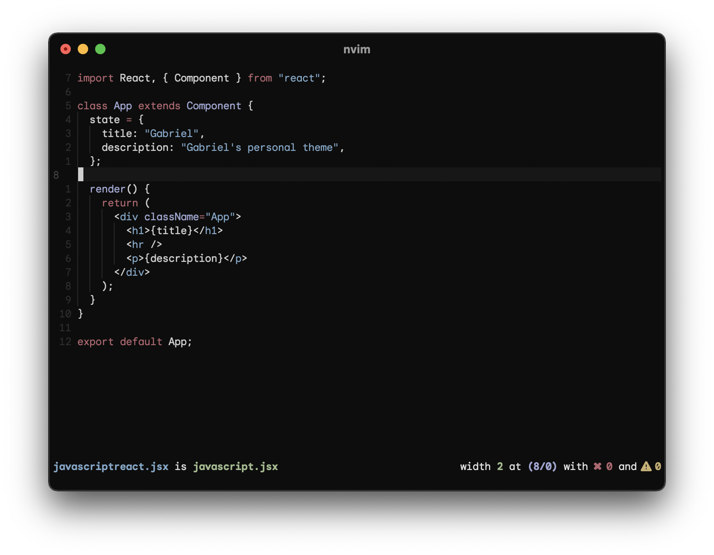
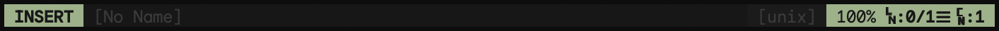
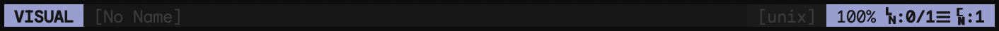
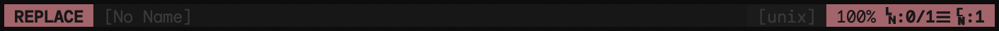

<p align="center">
  
</p>

# Vim Gabriel

    

Gabriel's (me) personal Vim & Neovim colorscheme.

<div align="center">
  
</div>

## Usage

Set the colorscheme inside `.vimrc` or `init.vim`:

```vim
colorscheme gabriel
```

On terminal emulators, make sure to set Vim to use `truecolor` in order for Gabriel to work as expected:

```vim
set termguicolors
```

To build and test the theme locally, use Make:

```sh
$ make # Or...
$ make watch # To get hot reload, just make sure to pip install when-changed
```

## Supported languages

This are the languages I've already implemented proper highlighting for:

-   JavaScript
-   JavaScript React (JSX)
    -   TypeScript
    -   TypeScriptReact (TSX)
-   Python
-   VimScript
-   HTML
-   JSON

There are more languages coming in soon (see [Contributing](https://github.com/gantoreno/vim-gabriel#contributing)).

## Airline

Gabriel also includes an [Airline](https://github.com/vim-airline/vim-airline) theme, make sure to set `g:airline_theme` to `gabriel` in your config file.






## Terminal

If you want other terminal output to match with Gabriel, then set your terminal emulator’s colors to match the ones below:

| Color      | Normal    | Bright    |
| ---------- | --------- | --------- |
| Black      | `#1b1b1b` | `#2b2b2b` |
| Red        | `#ac616a` | `#b3646e` |
| Green      | `#98b386` | `#a0bc8d` |
| Yellow     | `#bfa86b` | `#c9b16f` |
| Blue       | `#7ba2c3` | `#7fa7c9` |
| Magenta    | `#999dd4` | `#a2a6d4` |
| Cyan       | `#8ac6c7` | `#91cecf` |
| White      | `#d0d0d0` | `#e0e0e0` |
| Foreground | `#d0d0d0` |           |
| Background | `#0d0d0d` |           |

There's an included [iTerm2](https://iterm2.com/) colorscheme inside `schemes`, double-click it and it sould automatically be imported, search for the `Gabriel` colorscheme.

## Contributing

As you might know, maintaining a Vim colorscheme is no easy task. There are a lot of syntax highlighting libraries out there which all do slightly different things. Also, ever heard of [TreeSitter](https://tree-sitter.github.io/tree-sitter/)?

If you like the colorscheme, and you'd like to help me on making it even better, feel free to open pull requests adding more features. You can use my [VSCode theme](https://github.com/gantoreno/vscode-gabriel) as a guide on how things should look and feel for every language. I'll be glad to receive any kind of support regarding development!

## Credits

Special thanks to [Roman Lafourcade](https://github.com/romainl) for [Vim-RNB](https://github.com/romainl/vim-rnb), an amazing tool to create vim colorschemes with the Ruby language, made 100% easier the start of this project.

## License

Licensed under the [GNU GPLv3](https://www.gnu.org/licenses/gpl-3.0.html) license.
